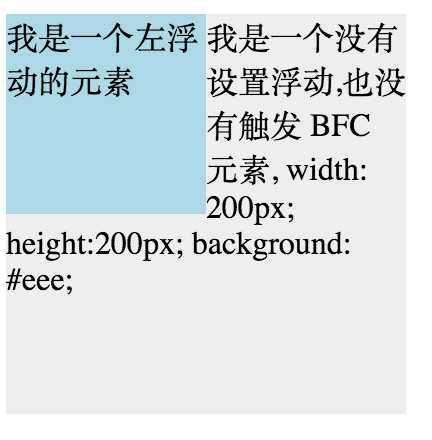

#####什么是BFC
BFC 即 Block Formatting Contexts (块级格式化上下文)

**具有 BFC 特性的元素可以看作是隔离了的独立容器，容器里面的元素不会在布局上影响到外面的元素，并且 BFC 具有普通容器所没有的一些特性**。

通俗一点来讲，可以把 BFC 理解为一个封闭的大箱子，箱子内部的元素无论如何翻江倒海，都不会影响到外部。

#####如何触发BFC

- body根元素
- float不为none
- display表现为（inline-block、table-cell、flex）
- position： fixed、absolute
- overflow不为visible


#####BFC特性及应用

1.在同一个BFC内部的两个相邻元素会发生外边距重叠

```html
    <head>
    div{
        width: 100px;
        height: 100px;
        background: lightblue;
        margin: 100px;
    }
    </head>
    <body>
        <div></div>
        <div></div>
    </body>
```

从效果上看，因为两个 div 元素都处于同一个 BFC 容器下 (这里指 body 元素) 所以第一个 div 的下边距和第二个 div 的上边距发生了重叠，所以两个盒子之间距离只有 100px，而不是 200px。

首先这不是 CSS 的 bug，我们可以理解为一种规范，***如果想要避免外边距的重叠，可以将其放在不同的 BFC 容器中***。

```html
    <head>
        .container {
            overflow: hidden;
        }
        p {
            width: 100px;
            height: 100px;
            background: lightblue;
            margin: 100px;
        }
    </head>
    <body>
        <div class="container">
            <p></p>
        </div>
        <div class="container">
            <p></p>
        </div>
    </body>
```

2.BFC 可以包含浮动的元素, 计算BFC高度时，浮动元素也参与计算（清除浮动）
 
 ```html
 <div style="border: 1px solid #000;">
     <div style="width: 100px;height: 100px;background: #eee;float: left;"></div>
 </div>
```
由于容器内元素浮动，脱离了文档流，所以容器只剩下 2px 的边距高度。如果使触发容器的 BFC，那么容器将会包裹着浮动元素。

```html
<div style="border: 1px solid #000;overflow: hidden">
    <div style="width: 100px;height: 100px;background: #eee;float: left;"></div>
</div>
```

3.形成了BFC的区域不会与float box重叠

先来看一个文字环绕效果：

```html
<div style="height: 100px;width: 100px;float: left;background: lightblue">我是一个左浮动的元素</div>
<div style="width: 200px; height: 200px;background: #eee">我是一个没有设置浮动, 
也没有触发 BFC 元素, width: 200px; height:200px; background: #eee;</div>
```



这时候其实第二个元素有部分被浮动元素所覆盖，(但是文本信息不会被浮动元素所覆盖) 如果想避免元素被覆盖，可触第二个元素的 BFC 特性，在第二个元素中加入 overflow: hidden，就会变成：


这个方法可以用来实现两列自适应布局，效果不错，这时候左边的宽度固定，右边的内容自适应宽度(去掉上面右边内容的宽度)。

