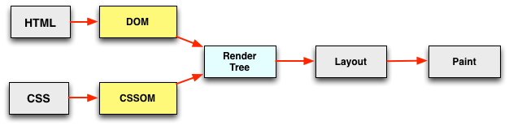

#####什么是 DOMContentLoaded
DOMContentLoaded顾名思义，就是**dom内容加载完毕**。那什么是dom内容加载完毕呢？我们从打开一个网页说起。当输入一个URL，页面的展示首先是空白的，然后过一会，页面会展示出内容，但是页面的有些资源比如说图片资源还无法看到，此时页面是可以正常的交互，过一段时间后，图片才完成显示在页面。**从页面空白到展示出页面内容，会触发DOMContentLoaded事件。而这段时间就是HTML文档被加载和解析完成**。

这时问题又来了，“HTML 文档被加载和解析完成”是什么意思呢？或者说，HTML 文档被加载和解析完成之前，浏览器做了哪些事情呢？那我们需要从浏览器渲染原理来谈谈。

浏览器向服务器请求到了 HTML 文档后便开始解析，产物是 DOM（文档对象模型），到这里 HTML 文档就被加载和解析完成了。如果有 CSS 的会根据 CSS 生成 CSSOM（CSS 对象模型），然后再由 DOM 和 CSSOM 合并产生渲染树。有了渲染树，知道了所有节点的样式，下面便根据这些节点以及样式计算它们在浏览器中确切的大小和位置，这就是布局阶段。有了以上这些信息，下面就把节点绘制到浏览器上。所有的过程如下图所示：



JavaScript 可以阻塞 DOM 的生成，也就是说当浏览器在解析 HTML 文档时，如果遇到 script标签，便会停下对 HTML 文档的解析，转而去处理脚本。如果脚本是内联的，浏览器会先去执行这段内联的脚本，如果是外链的，那么先会去加载脚本，然后执行。在处理完脚本之后，浏览器便继续解析 HTML 文档。看下面的例子：
```html
<body>
  <script type="text/javascript">
  console.log(document.getElementById('ele')); // null
  document.addEventListener("DOMContentLoaded", function (event) {
      console.log("初始DOM 加载并解析");
  });
  </script>

  <div id="ele"></div>

  <script type="text/javascript">
    console.log(document.getElementById('ele')); // <div id="ele"></div>
  </script>
</body>
```

另外，因为 JavaScript 可以查询任意对象的样式，所以意味着在 CSS 解析完成，也就是 CSSOM 生成之后，JavaScript 才可以被执行。

到这里，我们可以总结一下。当文档中没有脚本时，浏览器解析完文档便能触发 DOMContentLoaded 事件；如果文档中包含脚本，则脚本会阻塞文档的解析，而脚本需要等 CSSOM 构建完成才能执行。在任何情况下，DOMContentLoaded 的触发不需要等待图片等其他资源加载完成。

#####defer 与 DOMContentLoaded

如果 script 标签中包含 defer，那么这一块脚本将不会影响 HTML 文档的解析，而是等到 HTML 解析完成后才会执行。而 DOMContentLoaded 只有在 defer 脚本执行结束后才会被触发。 所以这意味着什么呢？HTML 文档解析不受影响，等 DOM 构建完成之后 defer 脚本执行，但脚本执行之前需要等待 CSSOM 构建完成。在 DOM、CSSOM 构建完毕，defer 脚本执行完成之后，DOMContentLoaded 事件触发。

#####async 与 DOMContentLoaded

如果 script 标签中包含 async，则 HTML 文档构建不受影响，解析完毕后，DOMContentLoaded 触发，而不需要等待 async 脚本执行、样式表加载等等。

----
**引入问题**
- 我们一再强调将css放在头部，将js文件放在尾部，这样有利于优化页面的性能，为什么这种方式能够优化性能？
>在解析html的过程中，html的解析会被中断，这是因为javascript会阻塞dom的解析。当解析过程中遇到*script*标签的时候，便会停止解析过程，转而去处理脚本，如果脚本是内联的，浏览器会先去执行这段内联的脚本，如果是外链的，那么先会去加载脚本，然后执行。在处理完脚本之后，浏览器便继续解析HTML文档。
>那么问题来了，既然Dom树完全生成好后页面才能渲染出来，浏览器又必须读完全部HTML才能生成完整的Dom树，script标签不放在body底部是不是也一样，因为dom树的生成需要整个文档解析完毕。
>现在浏览器为了更好的用户体验，渲染引擎会尝试尽快在屏幕上显示内容，
>它不会等到所有的HTMl元素解析之后在构建和布局dom树，所以部分内容将被解析并显示。
>也就是说浏览器能够渲染不完整的dom树和cssom，尽快的减少白屏的时间。
>假如我们将js放在header，js将阻塞解析dom，dom的内容会影响到dom树的绘制，导致dom绘制延后。
>所以说我们会将js放在后面，以减少dom绘制的时间，但是不会减少DOMContentLoaded被触发的时间。

- 在用jquery的时候，我们一般都会将函数调用写在ready方法内，这是什么原理？
>我们在 jQuery 中经常使用的 $(document).ready(function() { // ...代码... }); 其实监听的就是 DOMContentLoaded 事件，而 $(document).load(function() { // ...代码... }); 监听的是 load 事件。在用jquery的时候，我们一般都会将函数调用写在ready方法内，就是页面被解析后，我们就可以访问整个页面的所有dom元素，可以缩短页面的可交互时间，提高整个页面的体验。
