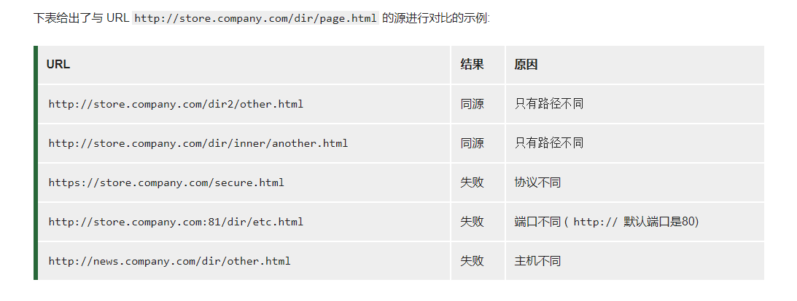

###什么是同源策略
同源策略（Same origin policy）是一种约定，它是浏览器最核心也最基本的安全功能，如果缺少了同源策略，则浏览器的正常功能可能都会受到影响。可以说 Web 是构建在同源策略基础之上的，浏览器只是针对同源策略的一种实现。
*所谓同源是指：域名、协议、端口相同*

####同源策略又分两种：
1. Dom同源策略： 禁止对不同源的Dom进行操作，主要场景是iframe跨域情况，不同域名的iframe是禁止互相访问；
2. XMLHttpRequest同源策略：禁止xhr对象向不同域名的服务器进行请求；

Cookie作用：
由于 HTTP 是无状态的协议，不能保存每一次请求的状态，所以需要给客户端增加 Cookie 来保存客 户端的状态。 Cookie 的作用主要用于 用户识别 和 状态管理 。（比如网页常见的记住密码）

>1. 客户端发送一个请求到服务器 
>2. 服务器发送一个HttpResponse响应到客户端，其中包含Set-Cookie的头部 
>3. 客户端保存cookie，之后向服务器发送请求时，HttpRequest请求中会包含一个Cookie的头部 
>4. 服务器返回响应数据

Expires: 过期时间，在设置的某个时间点后该 Cookie 就会失效(max-age 为0的话会立即删除，负数的话虽然过期，但是在浏览器未关闭前还会保留)

httpOnly: 通过JavaScript API 无法访问带有 HttpOnly 属性的cookie，用于预防xss攻击

Domain: 指定了哪些主机可以接受 Cookie。如果不指定，默认为 origin，不包含子域名。如果指定了Domain，则一般包含子域名。因此，指定 Domain 比省略它的限制要少。但是，当子域需要共享有关用户的信息时，这可能会有所帮助。                                                   
`例如，如果设置 Domain=mozilla.org，则 Cookie 也包含在子域名中（如developer.mozilla.org）。`

Path: Path 标识指定了主机下的哪些路径可以接受 Cookie（该 URL 路径必须存在于请求 URL 中）。以字符 %x2F ("/") 作为路径分隔符，子路径也会被匹配。
`例如，设置 Path=/docs，则以下地址都会匹配：`
 
 - /docs
 - /docs/Web/
 - /docs/Web/HTTP`

Secure: 标记为 Secure 的 Cookie 只应通过被 HTTPS 协议加密过的请求发送给服务端；

SameSite:
 - None: 浏览器会在同站请求、跨站请求下继续发送 cookies，不区分大小写。
 - Strict: 浏览器将只在访问相同站点时发送 cookie。
 - Lax: 与 Strict 类似，但用户从外部站点导航至URL时（例如通过链接）除外。 在新版本浏览器中，为默认选项，Same-site cookies 将会为一些跨站子请求保留，如图片加载或者 frames 的调用，但只有当用户从外部站点导航到URL时才会发送。如 link 链接
