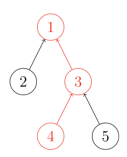
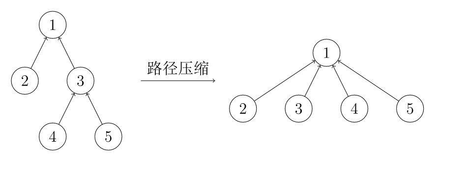
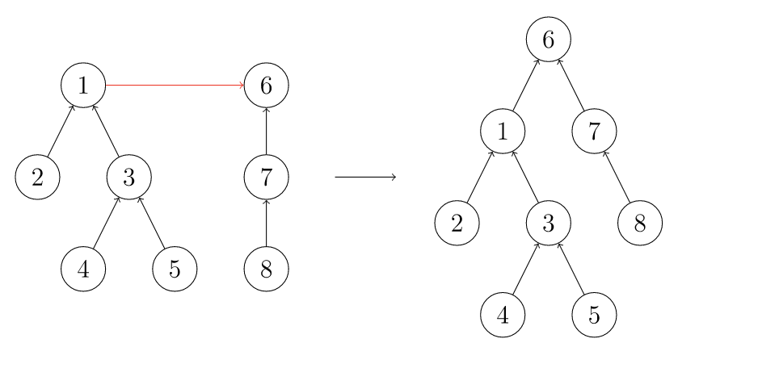

#### 并查集

并查集是一种树形的数据结构，顾名思义，它用于处理一些不交集的 合并 及 查询 问题。 它支持两种操作：
- 查找（Find）：确定某个元素处于哪个子集；
- 合并（Union）：将两个子集合并成一个集合。
  
> 并查集不支持集合的分离，但是并查集在经过修改后可以支持集合中单个元素的删除操作（详见 UVA11987 Almost Union-Find）。使用动态开点线段树还可以实现可持久化并查集

##### 查找

通俗地讲一个故事：几个家族进行宴会，但是家族普遍长寿，所以人数众多。由于长时间的分离以及年龄的增长，这些人逐渐忘掉了自己的亲人，只记得自己的爸爸是谁了，而最长者（称为「祖先」）的父亲已经去世，他只知道自己是祖先。为了确定自己是哪个家族，他们想出了一个办法，只要问自己的爸爸是不是祖先，一层一层的向上问，直到问到祖先。如果要判断两人是否在同一家族，只要看两人的祖先是不是同一人就可以了。

在这样的思想下，并查集的查找算法诞生了。


```c++
int fa[MAXN];  // 记录某个人的爸爸是谁，特别规定，祖先的爸爸是他自己
int find(int x) {
  // 寻找x的祖先
  if (fa[x] == x)  // 如果x是祖先则返回
    return x;
  else
    return find(fa[x]);  // 如果不是则x的爸爸问x的爷爷
}
```
显然这样最终会返回x的祖先。

##### 路径压缩

这样的确可以达成目的，但是显然效率实在太低。为什么呢？因为我们使用了太多没用的信息，我的祖先是谁与我父亲是谁没什么关系，这样一层一层找太浪费时间，不如我**直接当祖先的儿子**，问一次就可以出结果了。甚至祖先是谁都无所谓，只要这个人可以代表我们家族就能得到想要的效果。**把在路径上的每个节点都直接连接到根上，这就是路径压缩**。



这样我们的代码可以做这样的修改
```c++
int fa[MAXN];  // 记录某个人的爸爸是谁，特别规定，祖先的爸爸是他自己
int find(int x) {
  // 寻找x的祖先
  if (fa[x] == x)  // 如果x是祖先则返回
    return x;
  else
    return fa[x] = find(fa[x]); 
}
```

##### 合并

宴会上，一个家族的祖先突然对另一个家族说：我们两个家族交情这么好，不如合成一家好了。另一个家族也欣然接受了。
我们之前说过，并不在意祖先究竟是谁，所以只要其中一个祖先变成另一个祖先的儿子就可以了。



```c++
void unionSet(int x, int y) {
    //我们将学x，y所在的家族进行合并
    //我们只需要找到他们的祖先find(x) = find(y)
    x = find(x)
    y = find(y)
    fa[x] = y
}
```

##### 启发式合并（按秩合并）

一个祖先突然抖了个机灵：「你们家族人比较少，搬家到我们家族里比较方便，我们要是搬过去的话太费事了。」

由于需要我们支持的只有集合的合并、查询操作，当我们需要将两个集合合二为一时，无论将哪一个集合连接到另一个集合的下面，都能得到正确的结果。但不同的连接方法存在时间复杂度的差异。具体来说，如果我们将一棵点数与深度都较小的集合树连接到一棵更大的集合树下，显然相比于另一种连接方案，接下来执行查找操作的用时更小（也会带来更优的最坏时间复杂度）。
当然，我们不总能遇到恰好如上所述的集合————点数与深度都更小。鉴于点数与深度这两个特征都很容易维护，我们常常从中择一，作为估价函数。而无论选择哪一个，时间复杂度都为 O(n)，

如果只使用启发式合并，而不使用路径压缩，时间复杂度为O(mlog n) 。由于路径压缩单次合并可能造成大量修改，有时路径压缩并不适合使用。例如，在可持久化并查集、线段树分治 + 并查集中，一般使用只启发式合并的并查集。

```c++
std::vector<int> size(N, 1); // 记录并初始化子树的大小为 1
void unionSet(int x, int y) {
    int xx = find(x)
    int yy = find(y)
    if(xx == yy) return
    if (size[xx] > size[yy])  // 保证小的合到大的里
    swap(xx, yy);
    fa[xx] = yy;
    size[yy] += size[xx];
}
```