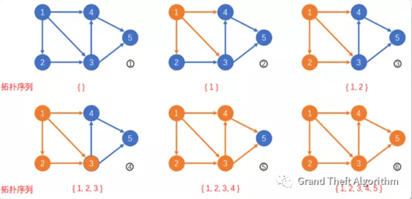

##拓扑排序

从给定的所有边中提取出改图的一个拓扑序列的过程，拓扑序列是一条满足图中有向边前后关系的序列，任一有向边起点在序列中一定早于终点出现。
如果图中有环，则无法提取出拓扑序列。所以拓扑排序的一个重要应用是在给定的有向图中判定是否存在环路。

在进行拓扑排序过程中我们需要知晓「入度」和「出度」的概念：
                
+ 入度：有多少条边直接指向该节点；
+ 出度：由该节点指出边的有多少条；

因此，对于有向图的拓扑排序，我们可以使用如下思路输出拓扑序（BFS 方式）：

1. 起始时我们需要将所有入度为0的节点进行入队操作
2. 从队列中进行节点的出对操作，**出队序列就是我们输出的拓扑序列**

    对于当前弹出的节点 xx，遍历 xx 的所有出度，即遍历所有由 xx 直接指向的节点 yy，
    对 yy 做入度减一操作（因为 xx 节点已经从队列中弹出，被添加到拓扑序中，等价于从
    xx 节点从有向图中被移除，相应的由 xx 发出的边也应当被删除，带来的影响是与 xx 相连的节点 yy 的入度减一）；

3. 对 yy 进行入度减一之后，检查 yy 的入度是否为 0，如果为0 则
将 yy 入队（当 yy 的入度为 0，说明有向图中在 yy 前面的所有的节点均被添加到拓扑序中，
此时 yy 可以作为拓扑序的某个片段的首部被添加，而不是违反拓扑序的定义）；

4. 循环2、3步骤直到队列清空

##拓扑排序的例子 (摘自leetcode作者：GTAlgorithm)

> Tips：下面的图示和说明可以帮大家更好的理解拓扑排序的过程

1. 首先，给定图中仅有节点 1 入度为 0，我们将其加入队列。
2. 我们将节点 1 为起点的有向边均删掉（在图中变为橙色），更新这些有向边终点的入度，节点 2,3,4 入度均减一，
变为 [0,1,1]。由于节点 2 的入度变为了 0，我们将其加入队列。
3. 我们将节点 2 为起点的有向边均删掉，更新这些有向边终点的入度，节点 3 入度减一，变为 [0]。我们将其加入队列
4. 我们将节点 3 为起点的有向边均删掉，更新这些有向边终点的入度，节点 4,5 入度均减一，变为 [0,1]。由于节点 4 的入度变为了 0，我们将其加入队列。
5. 我们将节点 4 为起点的有向边均删掉，更新这些有向边终点的入度，节点 5 入度减一，变为 [0]。由于节点 5 的入度变为了 0，我们将其加入队列。
6. 我们将节点 5 为起点的有向边均删掉，此时全图已经遍历完毕，没有新的节点被加入队列。
7. 队列为空，拓扑排序结束。

- LeetCode 802.找到最终的安全状态
- LeetCode 207.课程表 (中等)
- LeetCode 210.课程表II (中等)
- LeetCode 329.矩阵中的最长递增路径 (困难)
- LeetCode 1203.项目管理 （困难）

  
