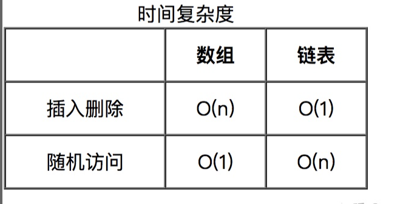

#### 介绍
链表是一种在物理存储单元上非连续、非顺序的存储结构数据元素的逻辑顺序是通过链表中的指针链接次序实现的。链表由一系列结点（链表中每一个元素称为结点）组成，
结点可以在运行时动态生成。每个结点包括两个部分：一个是存储数据元素的**数据域**，另一个是存储下一个结点地址的**指针域**。


#### 和顺序表的区别：
数组是需要一块连续的内存空间来存储，对内存的要求比较高。
而链表却相反，它并不需要一块连续的内存空间。链表是通过指针将一组零散的内存块串联在一起。

***
#####顺序表
可以快速的**查找**某个元素，但是在**插入**和**删除**时就要移动大量元素。原因就在于相邻元素的存储位置也具有邻居关系。他们的编号是 0，1，2，3，4，...，n，它们在内存中的位置也是紧挨着的，
中间没有空隙，所以就无法快速添加元素。而当删除后，当中就会留出空隙，自然需要弥补。

#####链表
无法快速的**查找**元素，但是我们在**插入**和**删除**的过程中只需修改指针，就可以完成




#### 代码实现

```javascript
    //定义单个链表节点
    class ListNode {
      constructor(val) {
          this.val = val // 数据
          this.next = null
      }
    }
```
```javascript
class LinkList {
    constructor() {
        this.length = 0
        this.head = null
    }

    // 向链表中添加节点
    append(element) {
        let node = new LinkNode(element)
        if (this.head == null) this.head = node
        let lastNode = this.getElementAt(this.length - 1)
        lastNode.next = node
        this.length++
    }

    // 在链表的指定位置插入节点
    insert(position, element) {
        if (position < 0 || position > this.length) return false
        let node = new LinkNode(element)

        if (position === 0) {
            node.next = this.head
            this.head = node
        } else {
            let pre = this.getElementAt(position - 1)
            node.next = pre.next
            pre.next = node
        }
        this.length++
        return true
    }

    // 删除链表中指定位置的元素，并返回这个元素的值
    removeAt(position) {
        if (position < 0 || position >= this.length) return null;
        let cur = this.head
        if (position === 0) {
            this.head = cur.next
        } else {
            let pre = this.getElementAt(position - 1)
            cur = pre.next
            pre.next = cur.next
        }
        this.length--
        return cur.element
    }

    // 删除链表中对应的元素
    remove(element) {
        let idx = this.indexOf(element)
        return this.removeAt(idx)
    }

    // 在链表中查找给定元素的索引
    indexOf(element) {
        let cur = this.head
        for(let i = 0; i<this.length; i++) {
            if(cur.element === element) return i
            cur = cur.next
        }

        return -1
    }

    // 返回链表中索引所对应的元素
    getElementAt(position) {
        if (position < 0 || position > this.length) return null
        let cur = this.head
        while (position--) {
            cur = cur.next;
        }

        return cur
    }

    // 判断链表是否为空
    isEmpty() {
        return this.length === 0
    }


    // 返回链表的长度
    size() {
        return this.length
    }

    // 返回链表的头元素
    getHead() {
        return this.head
    }

    // 清空链表
    clear() {
        this.head = null
        this.length = 0
    }

    // 辅助方法，按指定格式输出链表中的所有元素，方便测试验证结果
    toString() {
        let cur = this.head
        let str = ''

        while (cur) {
            let next = cur.next;
            next = next ? next.element : 'null';
            str += `{element: ${cur.element}, next: ${next}}`
            cur = cur.next
        }

        return str
    }
}
```


