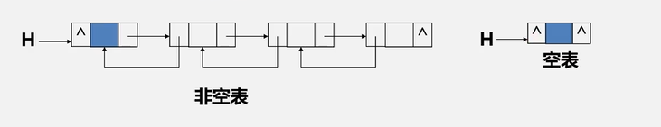
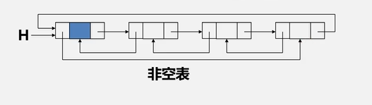

####双向链表
在单链表的每个节点中再增加一个指向其直接前驱的指针域prev，这样表中就形成了两个不同方向的链，称为双向链表

优点： 单链表只存在指向后继结点的指针域，查找后继节点O(1),但是我们在查找前继节点时，我们需要从表头开始查找
时间复杂度O(n),双向链表可以让我们在O(1)复杂度查找前继节点

双向链表满足结构的对称性即：p.prev.next == p == p.next.prev

#### 双向循环链表

和单链表类似，双向链表也可以有循环链表
 1. 让头节点的前驱指针指向链表的最后一个节点
 2. 让最后一个节点的后继指针指向头节点

