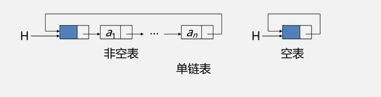

####循环链表
一种头尾相连的链表（表中最后一个指针域指向头节点，整个链表组成一个环）

优点：从任意一个结点出发可以找到表中其他节点

******
循环链表的表示方式(表的操作常常是在表的首尾进行)

- 头指针表示单循环链表：
    - 查找头节点的时间复杂度O(1)
    - 查找尾节点的时间复杂度O(n)

- 尾指针表示单循环链表：
     - 查找头节点的时间复杂度O(1)
     - 查找尾节点的时间复杂度O(1)
